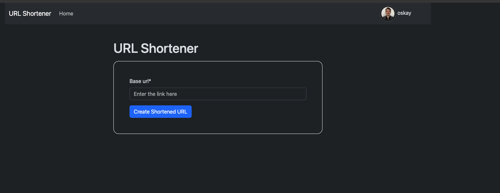
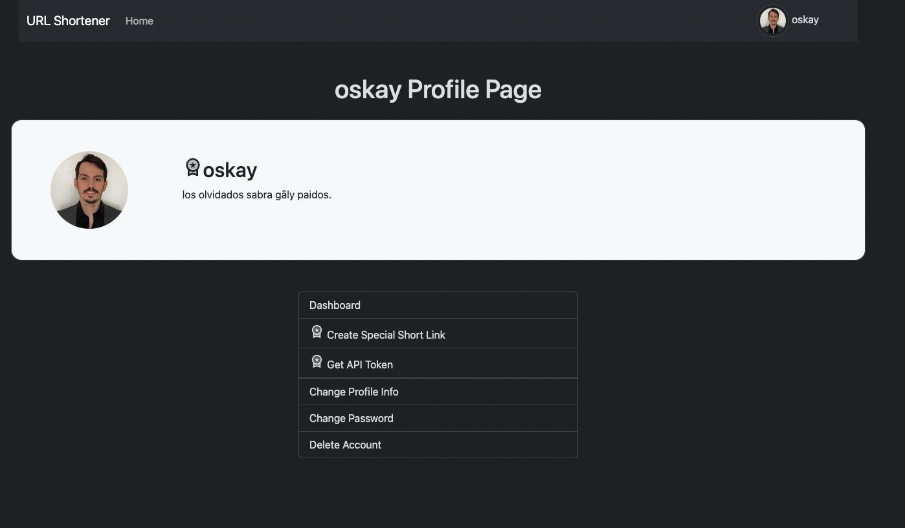
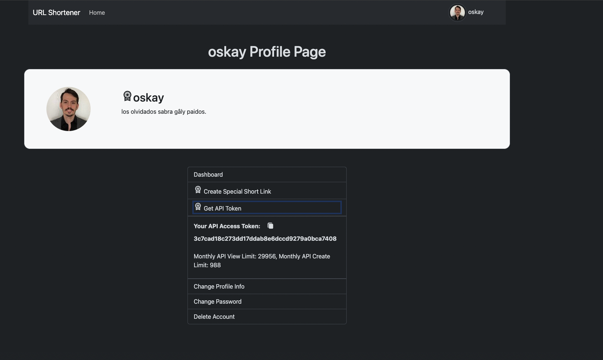

# URL Shortener Project


This URL shortener project is built using Django and Django REST framework, utilizing PostgreSQL for enhanced security, speed, and stability. It offers a robust platform for users to shorten URLs and track their statistics through a personalized dashboard. Below are the key features and instructions on how to use the project.

## Features

- **URL Shortening**: Registered users or random visitors can shorten their long URLs from the home page. The long URL will be shortened to a short URL of 5 characters, regardless of the URL length.

For example:

        - http://localhost:8000/acde0/
        - http://localhost:8000/kklem/

- **Premium User URL Shortening:** Premium users can make their long URLs shorter with the slug of their choice on the special URL shortening page accessible from the Profile detail page.

For example:

       - http://localhost:8000/oskay/
       - http://localhost:8000/premium-user-slug/
       - http://localhost:8000/p/

- **PostgreSQL Database**: Chosen for its security, speed, and stability.
- **User Dashboard**: All logged-in users have access to a dashboard displaying stats for their shortened URLs.
- **URL Stats**: Only the statistics of shortened urls created by logged-in users can be viewed on the dashboard. URL's stats that created by random users can not be followed.
- **Profile Detail Page**: Each user has a profile detail page. Premium users enjoy additional sections within their profile page.
- **Privacy**: Only logged-in users can access their profile detail page and other app features ensuring user privacy across the platform.
- **Custom Slugs**: Premium users can create customized shortened slugs for their URLs.
- **Deletion via API**: Premium users have the ability to delete shortened URLs through the API.
- **Automated Token Creation**: User tokens are automatically created using signaling, with premium users able to view their API token within their account profile.
- **REST API**: The application includes a REST API, accessible exclusively by premium users, with monthly limits of 30,000 views and 1,000 creations. Premium users can list, see detail, create, delete any URL by using API.

### API Endpoints

- **List URLs**: `/api/list/` - Retrieve a list of your URLs.
- **Create URL**: `/api/create/` - Create a new shortened URL.
- **URL Detail**: `/api/detail/<url_id>` - Get details of a specific URL (e.g., `/api/detail/9/`).
- **Delete URL**: `/api/delete/<id>` - Delete a specific shortened URL.
- **Token Authentication**: `/api/token/` - Obtain your API token for accessing the API.

### Restrictions

- Users can only interact with their own URLs through the API.
- API access requires token authentication, ensuring secure and private interactions.

## Getting Started

To get started with this project, follow these steps:

**Step 1**: Clone the project
```bash
git clone https://github.com/oskaygunacar/django-rest-url-shortener.git
```

**Step 2**: Navigate to the directory
```bash
cd django-rest-url-shortener
```

**Step 3**: Create and activate a virtual environment
```bash
# Create
python -m venv env

# Activate for MacOS & Linux
source env/bin/activate

# Activate for Windows
env\Scripts\activate
```

**Step 4**: Install dependencies
```bash
pip install -r requirements.txt
```
**Step 5**: Configure Settings.py Database Configurations

**If you are planning to use PostgreSQL or other databases, please configure the Settings.py database config first.**

**Step 6**: Migrate the database and create a superuser
```bash
python manage.py migrate
python manage.py createsuperuser
```

**Step 7**: Run the server
```bash
python manage.py runserver
```

## Usage

- Navigate to the site URL to create an account and start shortening URLs.
- Upgrade to a premium account to access advanced features such as custom slugs and API access.

## Contributing

Contributions to improve the project are welcome. Please follow the standard fork-and-pull request workflow.


## Images:
### Homepage URL Shortener

### Profile Detail

### Profile Detail  - Getting API Token From Profile Detail Page For Premium Users Only


